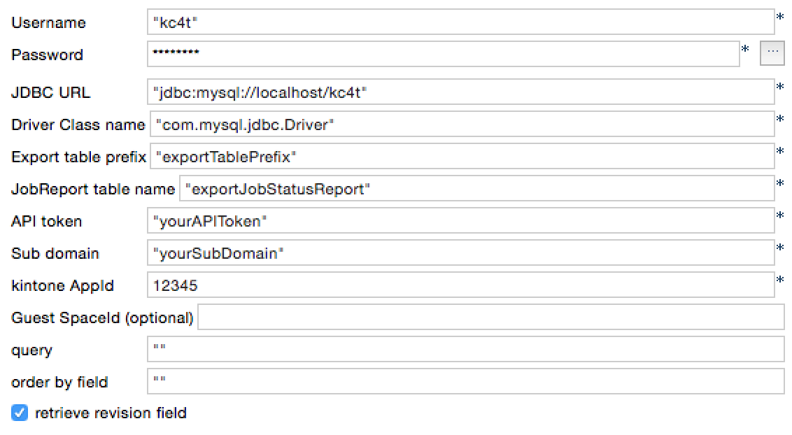

# How to use tKintoneInput component

tKintoneInput do export from remote kintone application to your RDB table(s).

## Deploy

* Start up your IDE(TOS_DI)
* Setup "Custom Components" folder
    * create a "Custom Components" folder somewhere handy on your disk.
    * In Window-> Preferences-> Talend-> Components
    * set "User component folder"
* copy src/tKintoneInput to your "Custom Components" folder

## Configuration parameters

### JDBC settings

| Parameter | Description |
|:----------|-------------|
| Username | JDBC User name |
| Password | JDBC Password |
| JDBC URL | Set your JDBC URL |
| Driver Class name | JDBC driver you want to use |

### Setting the output destination

| Parameter | Description |
|:----------|-------------|
| Export table prefix | Data export table name prefix |
| JobReport table name | ExportJob result report table name |

### Setting for kintone

| Parameter | Description |
|:----------|-------------|
| API token | your target kintone applications API token |
| Sub domain | the application's subdomain |
| kintone AppId | application ID(numeric only) |
| Guest SpaceId | if the application is in the guest space, set the Guest Space ID(numeric only) |
| query | if you need to use query parameter, set this. if you not set this, component calls exportAllFromKintone method, try to export of all records. |
| order by field | default is "RECORD_NUMBER". but if your application do not have "RECORD_NUMBER", set your sort field name. |
| retrieve revision field | default is "true". if you check off this, do not retrieve REVISION field from kintone records. |

## Execute result

if export job was success, you can get this result parameters.

| Parameter | Description |
|:----------|-------------|
| JobId | Current JobId (table suffix) |
| MainTable | Exported table name |
| SubTables | if you have any subtable records, their names are listed in a comma-separated. |

## Notes

* Currently table is not deleted. Each time a job is run, the table will increase.