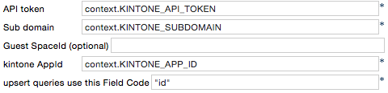
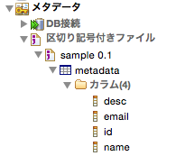
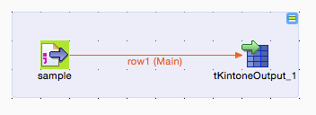
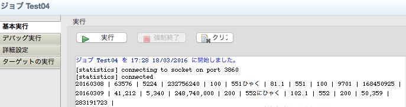

# How to use tKintoneOutput component

tKintoneOutput do export from your RDB table row to remote kintone application.

## Deploy

* Start up your IDE(TOS_DI)
* Setup "Custom Components" folder
    * create a "Custom Components" folder somewhere handy on your disk.
    * In Window-> Preferences-> Talend-> Components
    * set "User component folder"
* copy src/tKintoneOutput to your "Custom Components" folder

## Configuration parameters

### Setting for kintone

| Parameter | Description |
|:----------|-------------|
| API token | your target kintone applications API token. This token is a must have permissions of all viewing, additional and updating. |
| Sub domain | the application's subdomain |
| Guest SpaceId | if the application is in the guest space, set the Guest Space ID(numeric only) |
| kintone AppId | application ID(numeric only) |
| upsert queries use this Field Code | set your kintone application's "PRIMARY Key". kc4t tries select query use this field. if there are no record, try to insert. if present, will try to update. |

## How to mapping schema to kintone's fields

Column of the schema and fields of the kintone is a one-to-one correspondence by name.

If there is a column did not exist in the field of kintone, it is simply ignored.

## How to connect components

tKintoneOutput will receive a row.

The above example, kc4t are receiving a row from tFileInputDelimited.

## Execute result

All fields are dump to system.out. If there are any errors, the job will be stopped and error contents are output as it is.

(This behavior is improvement plans to return an error status to successfully finished.)
